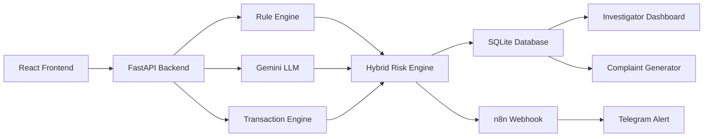
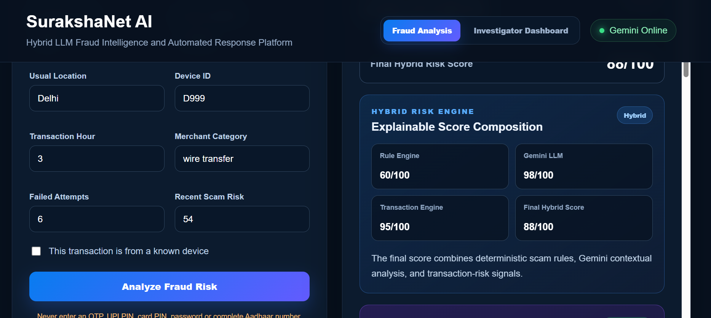
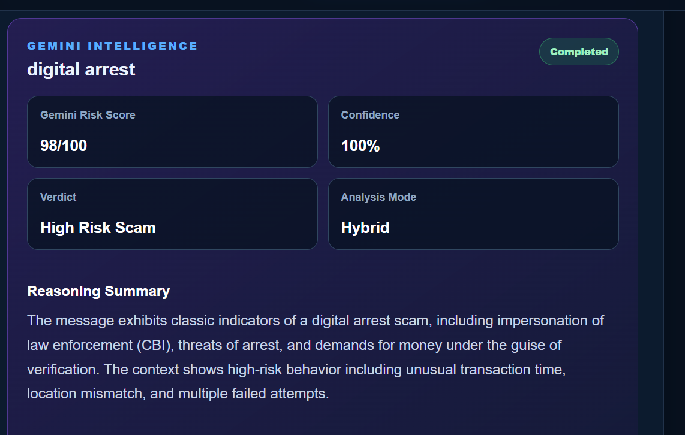
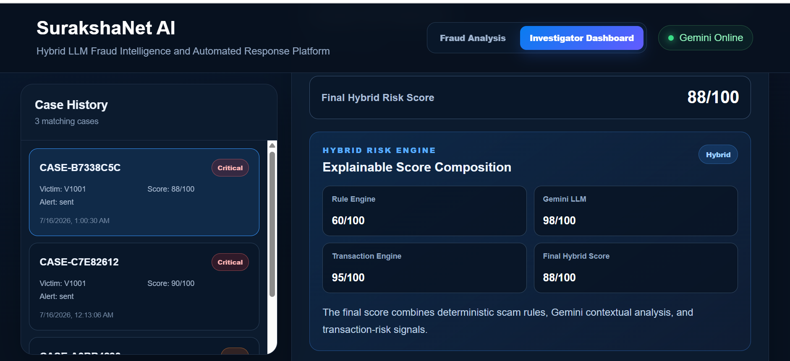
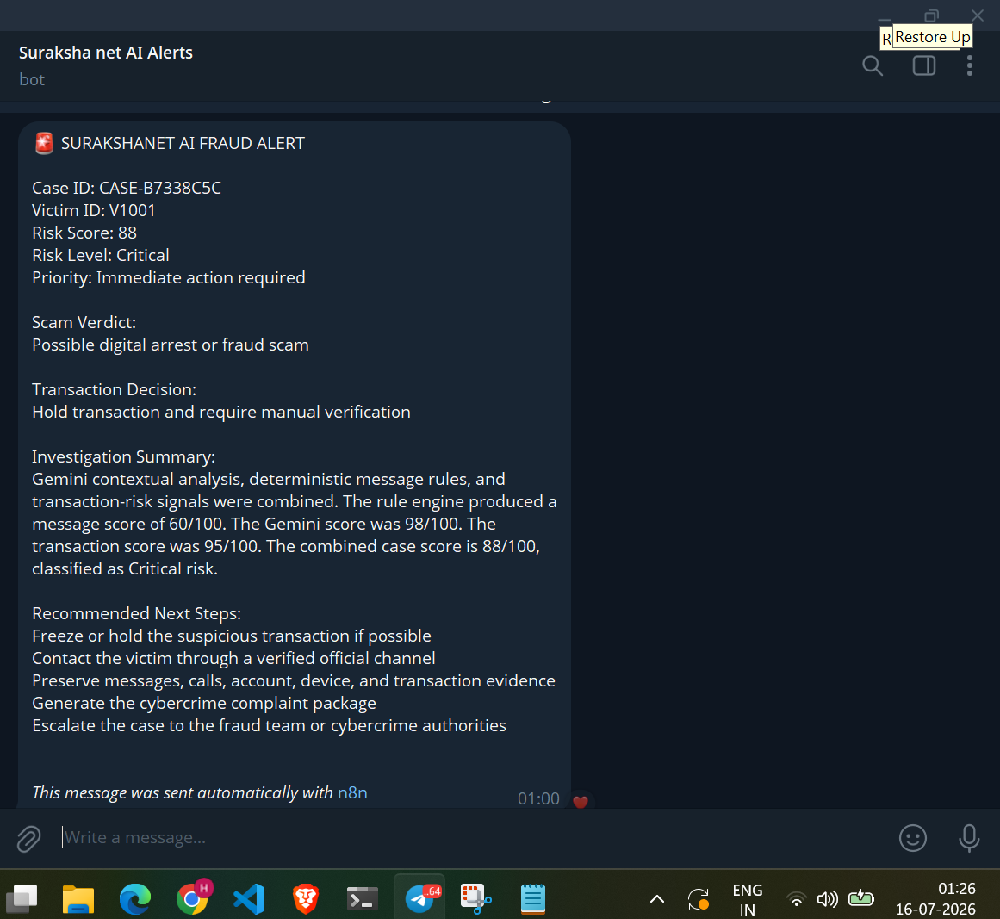
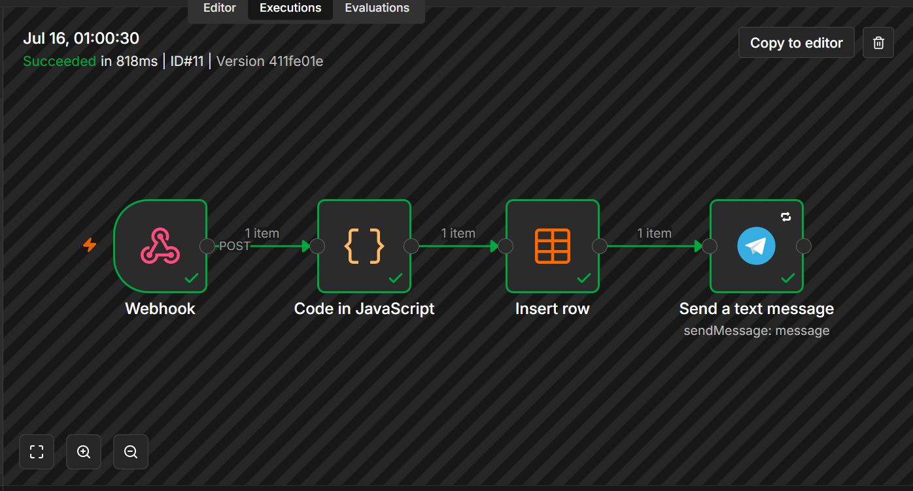
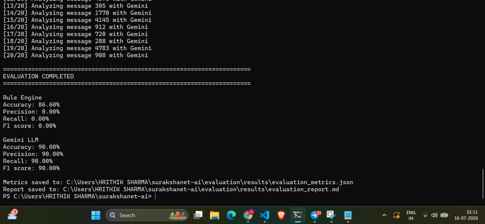

<div align="center">

# 🛡️ SurakshaNet AI

### Hybrid LLM Fraud Intelligence & Automated Response Platform

**Detect suspicious communication • Explain fraud risk • Trigger automated response • Preserve investigation evidence**

<p>
  
  
  
</p>

<p>
  
  
  
</p>

<p>
  
  
  
  
</p>

</div>

> [!IMPORTANT]
> SurakshaNet AI combines deterministic fraud rules, Gemini contextual intelligence, transaction-risk analysis, n8n automation, Telegram alerts, persistent case storage and complaint generation in one explainable workflow.

---
## Problem

Digital-arrest scams, authority impersonation, phishing, credential theft, payment coercion, and suspicious financial transactions are often handled through disconnected systems.

Victims and investigators need a practical platform that can:

1. Detect scam indicators quickly.
2. Understand manipulation and social-engineering context.
3. Analyse transaction anomalies.
4. Explain why a case is risky.
5. Trigger an immediate response.
6. Preserve an investigation record.
7. Generate a complaint-support package.

## Solution

SurakshaNet AI implements the following pipeline:

```text
Suspicious Message + Transaction Context
                  |
                  v
        Deterministic Rule Engine
                  |
                  v
          Gemini LLM Analysis
                  |
                  v
       Transaction Risk Engine
                  |
                  v
       Explainable Hybrid Score
                  |
          +-------+--------+
          |                |
          v                v
   SQLite Case Store   n8n Workflow
          |                |
          v                v
 Investigator Dashboard  Telegram Alert
          |
          v
 Complaint Support Package
```

## Key Features

- Deterministic fraud-pattern detection
- Google Gemini structured scam analysis
- Transaction anomaly detection
- Explainable hybrid risk scoring
- Safe rule-engine fallback when Gemini is unavailable
- SQLite case storage
- Investigator dashboard
- Search and risk filtering
- Automated n8n workflow
- Real-time Telegram fraud alerts
- Cybercrime complaint-package generation
- Public-dataset evaluation
- Accuracy, precision, recall, F1 and latency reporting

## Hybrid Fraud Analysis

SurakshaNet combines three independent signals:

- Rule-engine score
- Gemini contextual risk score
- Transaction-risk score

When Gemini succeeds:

```text
Message Risk =
40% Rule Engine
+
60% Gemini LLM
```

```text
Final Risk =
60% Message Risk
+
40% Transaction Risk
```

Equivalent total contribution:

```text
Rule Engine: 24%
Gemini LLM: 36%
Transaction Engine: 40%
```

When Gemini is unavailable:

```text
Final Risk =
50% Rule Engine
+
50% Transaction Engine
```

This allows the platform to continue functioning even when the external LLM service is unavailable.

## Gemini Intelligence

Gemini returns structured fraud intelligence containing:

- Scam type
- Verdict
- Risk score
- Confidence score
- Reasoning summary
- Observable evidence
- Manipulation tactics
- Recommended action
- Detected language
- Model latency

Example output:

```json
{
  "scam_type": "digital arrest",
  "verdict": "high_risk_scam",
  "risk_score": 98,
  "confidence": 0.99,
  "evidence": [
    "CBI impersonation",
    "Digital arrest threat",
    "Payment demand"
  ],
  "manipulation_tactics": [
    "fear",
    "authority impersonation",
    "urgency",
    "payment pressure"
  ]
}
```

## Transaction-Risk Analysis

The transaction engine checks:

- Amount compared with the user's average
- Current location versus usual location
- Known or unknown device
- Transaction time
- Merchant category
- Failed transaction attempts
- Recent scam-risk signals

## Automated Incident Response

Critical reports are sent to an n8n workflow.

The workflow:

1. Receives the complete case report through a webhook.
2. Extracts important investigation fields.
3. Stores workflow data.
4. Formats a fraud alert.
5. Sends the alert to Telegram.

Telegram alerts include:

- Case ID
- Victim ID
- Final risk score
- Risk level
- Priority
- Scam verdict
- Transaction decision
- Investigation summary
- Recommended next steps

## Investigator Dashboard

The dashboard provides:

- Total stored cases
- Critical, High, Medium and Low case counts
- Average risk score
- Alert-delivery count
- Case search
- Risk filtering
- Alert-status filtering
- Complete case details
- Gemini findings
- Explainable hybrid score composition
- Complaint preview and download

## Complaint Package

Investigators can generate a complaint-support document containing:

- Case information
- Scam assessment
- Transaction assessment
- Investigation summary
- Recommended actions
- Suggested evidence
- Automated alert status
- Safety notice
- Responsible-use disclaimer

## System Architecture



## Technology Stack

### Frontend

- React
- Vite
- JavaScript
- CSS

### Backend

- Python
- FastAPI
- Pydantic
- SQLite
- Requests

### Artificial Intelligence

- Google Gemini
- Structured JSON output
- Deterministic rule fallback
- Explainable hybrid scoring

### Automation

- n8n
- Webhooks
- Telegram Bot integration

### Evaluation

- UCI SMS Spam Collection
- Accuracy
- Precision
- Recall
- Specificity
- F1 score
- Confusion matrix
- Latency measurement

## Evaluation Results

The message-classification layer was tested using the UCI SMS Spam Collection.

### Gemini Balanced-Sample Evaluation

Gemini was evaluated on a balanced sample containing:

- 10 spam messages
- 10 legitimate messages
- 20 total messages

| Metric | Result |
|---|---:|
| Accuracy | 90.00% |
| Precision | 90.00% |
| Recall | 90.00% |
| F1 Score | 90.00% |

### Deterministic Rule Engine

| Metric | Result |
|---|---:|
| Accuracy | 86.60% |
| Precision | 0.00% |
| Recall | 0.00% |
| F1 Score | 0.00% |

The deterministic engine is intentionally specialised for high-risk scams such as:

- Digital arrest
- Authority impersonation
- Credential theft
- Arrest threats
- Payment coercion
- Forced secrecy
- Remote-access requests

It is not designed as a general promotional-spam classifier.

The rule-engine accuracy is caused mainly by the large number of legitimate messages in the dataset and must not be interpreted as strong generic spam-detection performance.

This result demonstrates why SurakshaNet uses a hybrid architecture rather than relying only on keyword rules.

The complete evaluation report is available at:

```text
evaluation/results/evaluation_report.md
```

## Repository Structure

```text
surakshanet-ai/
│
├── backend/
│   ├── main.py
│   ├── database.py
│   ├── complaint.py
│   ├── llm_analyzer.py
│   ├── hybrid_engine.py
│   ├── test_llm.py
│   └── requirements.txt
│
├── frontend/
│   ├── src/
│   │   ├── App.jsx
│   │   ├── App.css
│   │   ├── index.css
│   │   └── main.jsx
│   ├── package.json
│   └── vite.config.js
│
├── evaluation/
│   ├── download_sms_dataset.py
│   ├── run_evaluation.py
│   ├── data/
│   └── results/
│
├── n8n-workflows/
│   ├── SETUP.md
│   └── surakshanet-workflow.json
│
├── docs/
│   ├── screenshots/
│   ├── architecture.md
│   ├── demo-script.md
│   ├── privacy-and-ethics.md
│   └── submission-summary.md
│
├── .env.example
├── .gitignore
├── LICENSE
└── README.md
```

## Local Installation

### Clone the repository

```bash
git clone YOUR_GITHUB_REPOSITORY_URL
cd surakshanet-ai
```

### Configure environment variables

Create:

```text
backend/.env
```

Add:

```env
N8N_WEBHOOK_URL=http://localhost:5678/webhook/surakshanet-alert

LLM_ENABLED=true
GEMINI_MODEL=gemini-3.1-flash-lite
GEMINI_API_KEY=YOUR_GEMINI_API_KEY
```

Never commit the real `.env` file.

### Install backend dependencies

```powershell
cd backend

python -m venv venv

.\venv\Scripts\python.exe -m pip install -r requirements.txt
```

### Start the backend

```powershell
.\venv\Scripts\python.exe -m uvicorn main:app --host 127.0.0.1 --port 8001
```

Backend health endpoint:

```text
http://127.0.0.1:8001/health
```

### Start the frontend

```powershell
cd frontend

npm install

npm run dev
```

Frontend:

```text
http://localhost:5173
```

### Start n8n

```powershell
n8n start
```

n8n:

```text
http://localhost:5678
```

Import:

```text
n8n-workflows/surakshanet-workflow.json
```

## Main API Endpoints

| Method | Endpoint | Purpose |
|---|---|---|
| GET | `/health` | Backend and integration health |
| POST | `/analyze-scam` | Rule-based scam analysis |
| POST | `/analyze-transaction` | Transaction-risk analysis |
| POST | `/generate-case-report` | Generate a hybrid report |
| POST | `/generate-case-report-with-alert` | Generate, store and alert |
| GET | `/cases` | List stored cases |
| GET | `/cases/{case_id}` | View complete case |
| GET | `/dashboard-summary` | Dashboard statistics |
| GET | `/complaints/{case_id}` | Preview complaint data |
| GET | `/complaints/{case_id}/download` | Download complaint document |

## Running the Evaluation

Download the dataset:

```powershell
.\backend\venv\Scripts\python.exe .\evaluation\download_sms_dataset.py
```

Run the rule-engine evaluation:

```powershell
.\backend\venv\Scripts\python.exe .\evaluation\run_evaluation.py --skip-llm
```

Run the Gemini balanced-sample evaluation:

```powershell
.\backend\venv\Scripts\python.exe .\evaluation\run_evaluation.py --llm-per-class 10 --delay 3
```

Saved Gemini predictions are reused to avoid consuming unnecessary API quota.

## Responsible AI and Safety

SurakshaNet AI is an investigation-support platform.

It is not an autonomous banking, legal or law-enforcement decision-maker.

Safeguards include:

- Human review for high-impact decisions
- Explainable component scores
- Observable evidence display
- Deterministic fallback
- API keys stored only on the backend
- Safety warnings in complaint packages
- No request for OTP, PIN or passwords
- Honest benchmark limitations

The system must not be used as the sole basis for:

- Accusing an individual
- Permanently blocking an account
- Filing a criminal allegation
- Taking legal action
- Making a final financial decision

## Current Limitations

- Gemini evaluation currently uses a small balanced sample.
- The UCI dataset evaluates SMS classification only.
- The dataset does not include device, location or transaction context.
- The deterministic engine is specialised for high-risk scams.
- The current deployment is a local prototype.
- Telegram delivery depends on the external n8n workflow.
- Generated reports require human review.

## Future Scope

- Multilingual Indian-language fraud analysis
- Voice-call transcription
- Scam-call detection
- URL and domain reputation analysis
- Bank and telecom API integration
- Investigator authentication
- Evidence-file uploads
- Graph-based fraud-network analysis
- Cloud deployment
- Larger Indian cybercrime datasets


## 📸 Product Showcase

<table>
<tr>
<td width="50%" valign="top">

### 🔍 Hybrid Fraud Analysis

The platform combines rule-engine, Gemini and transaction-risk scores into one explainable result.



</td>
<td width="50%" valign="top">

### 🧠 Gemini Intelligence

Gemini identifies scam type, confidence, evidence, manipulation tactics and recommended actions.



</td>
</tr>

<tr>
<td width="50%" valign="top">

### 🕵️ Investigator Dashboard

Investigators can review case history, risk levels, alert status and complete hybrid intelligence.



</td>
<td width="50%" valign="top">

### 🚨 Automated Telegram Alert

Critical incidents are delivered automatically through the n8n Telegram workflow.



</td>
</tr>

<tr>
<td width="50%" valign="top">

### ⚙️ n8n Response Workflow

Webhook data is processed, stored and converted into an operational Telegram alert.



</td>
<td width="50%" valign="top">

### 📊 Real-Data Evaluation

The evaluation pipeline reports accuracy, precision, recall, F1 score and processing latency.



</td>
</tr>
</table>

---

## 🏆 Why SurakshaNet Stands Out

| Capability | SurakshaNet Approach |
|---|---|
| Fraud detection | Deterministic rules and Gemini contextual intelligence |
| Financial protection | Transaction anomaly and risk scoring |
| Explainability | Separate rule, LLM, transaction and final scores |
| Automated response | n8n webhook and Telegram alert |
| Investigation support | Persistent SQLite case history |
| Complaint support | Downloadable cybercrime complaint package |
| Reliability | Safe deterministic fallback when Gemini fails |
| Validation | Public-dataset evaluation with transparent limitations |

## License

This project is released under the MIT License.

## Disclaimer

SurakshaNet AI is an educational and hackathon prototype. It must not be used as the sole basis for blocking accounts, accusing individuals, taking legal action, or making final financial decisions.
